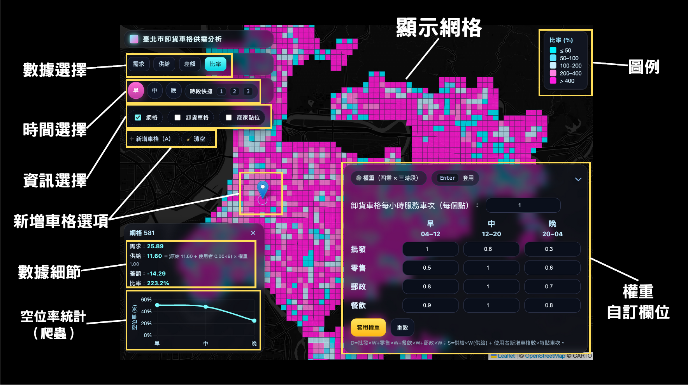
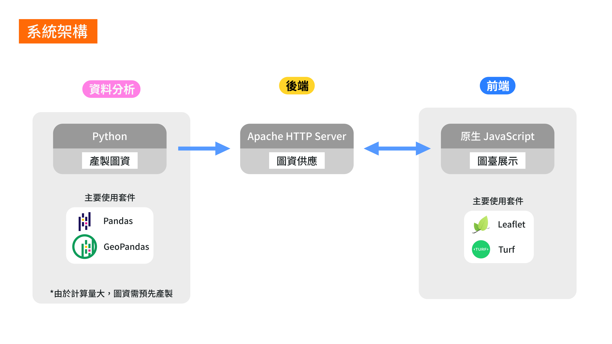
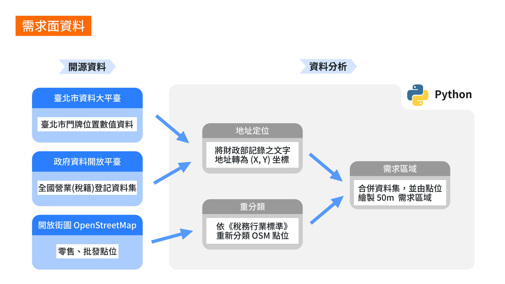
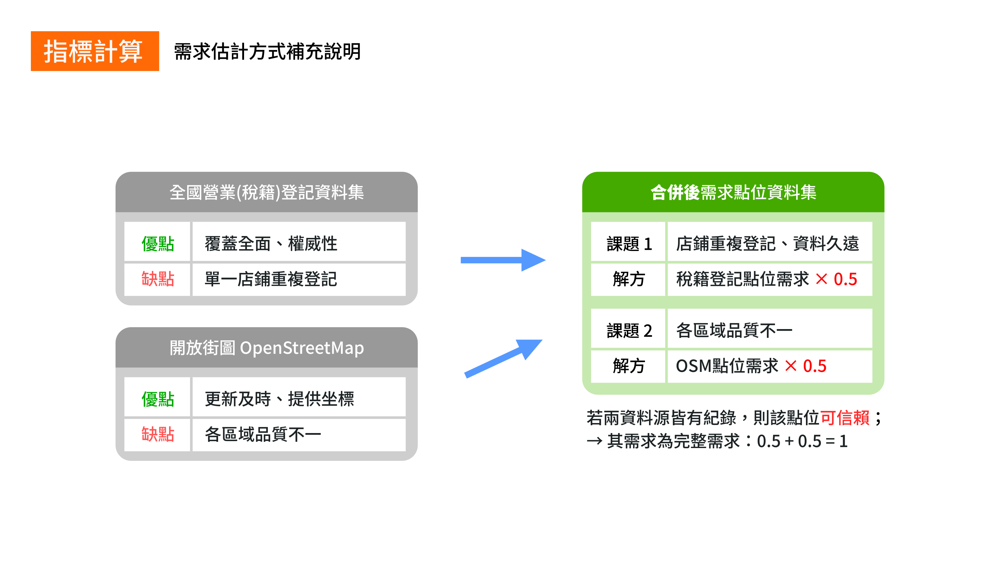
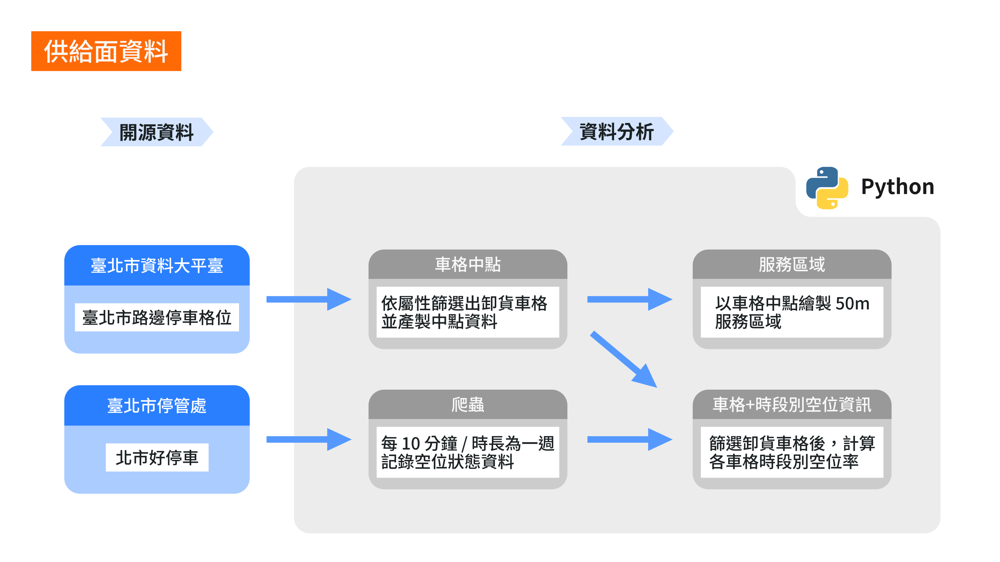
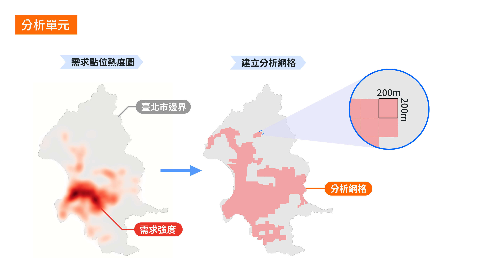
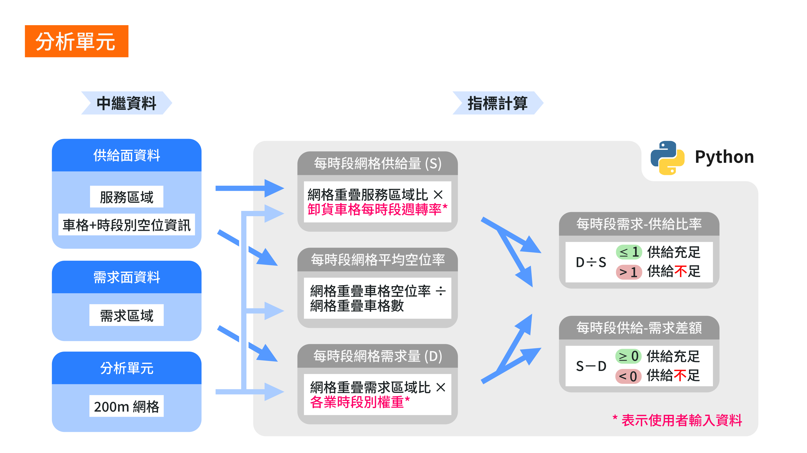
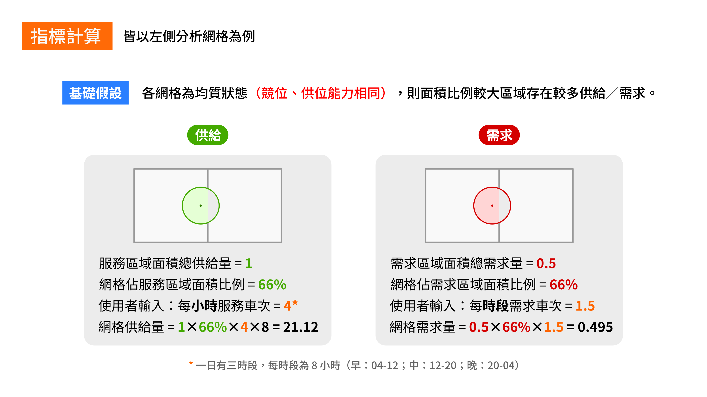

# Taipei-Parking

臺北市路邊卸貨停車格供需分析系統。

## 指令行介面

### 北市好停車爬蟲

前往[北市好停車](https://itaipeiparking.pma.gov.taipei/)收集即時路邊停車位資訊的自動化程式，發送請求的最小間距為 0.5 秒。\
Python 環境內需安裝：

* [Python](https://www.python.org/downloads/) - *3.11+*
* [Beautiful Soup](https://pypi.org/project/beautifulsoup4/)
* [Pandas](https://pypi.org/project/pandas/)
* [Requests](https://pypi.org/project/requests/)
* [Shapely](https://pypi.org/project/shapely/)

```shell
# 基本語法
python script/crawler.py

# 指定搜尋組別（例：第 1 組）
python script/crawler.py -g 1

# 指定執行次數（例：無限次）
python script/crawler.py -r 0
```

組別可填 0 ～ 4，`0` 為全臺北市、`1` 為北區、`2` 為西區、`3` 為南區、`4` 為東區。\
輸出的 GeoJSON 檔案名格式為 `W-HH-MM-SS (YY-mm-DD).geojson`，其中 `W` 為由 1（星期一）至 7（星期日）的日期。每個圖徵包含以下欄位：

* `id`—停車位編號
* `name`—停車位名稱
* `service`—服務時間
* `timestamp`—時間戳
* `toll`—收費標準
* `occupied`—停車位是否被占用？

### 空位狀態彙整程式

將[北市好停車爬蟲](#北市好停車爬蟲)收集的空位資訊彙整為單一 JSON 檔案。\
Python 環境內需安裝：

* [Python](https://www.python.org/downloads/) - *3.11+*
* [GeoPandas](https://pypi.org/project/geopandas/)

```shell
# 基本語法
python script/aggregate.py

# 輸入既有已彙整 JSON
python script/aggregate.py -l data/history.json

# 輸出冗餘日誌
python script/aggregate.py -v
```

輸出的 JSON 檔案名為 `history.json`，每一筆紀錄為停車位編號與空位狀態的鍵值對。\
空位狀態由 7 個列表組成，表示星期一至星期日、每日 00:00 至 23:50 之間、每 10 分鐘空位情況的時間序列。`0` 表示空位，`1` 表示佔位，`null` 表示無資料。\
範例如下所示：

```json
"路邊停車位_1": {
    "1": [0, 0, 0, 1, /* ...共 144 筆... */ 0, 1],
    "2": [0, 0, 0, 0, /* ...共 144 筆... */ 1, 1],
    "3": [1, 1, 1, 1, /* ...共 144 筆... */ 1, 1],
    "4": [1, 1, 1, 1, /* ...共 144 筆... */ 1, 1],
    "5": [1, 1, 1, 1, /* ...共 144 筆... */ 0, 0],
    "6": [0, 0, 0, 0, /* ...共 144 筆... */ 0, 0],
    "7": [0, 1, 1, 1, /* ...共 144 筆... */ 1, 1]
}
```

### 車格靜態資訊彙整程式

將[北市好停車爬蟲](#北市好停車爬蟲)收集的其餘靜態資訊彙整為單一 GeoJSON 檔案。\
Python 環境內需安裝：

* [Python](https://www.python.org/downloads/) - *3.11+*
* [GeoPandas](https://pypi.org/project/geopandas/)

```shell
# 基本語法
python script/extract.py

# 輸入既有已彙整 GeoJSON
python script/extract.py -l data/realtime-lot.geojson

# 輸出冗餘日誌
python script/extract.py -v
```

輸出的 GeoJSON 檔案名為 `realtime-lot.geojson`，各圖徵的欄位和[北市好停車爬蟲](#北市好停車爬蟲)產生的 GeoJSON 檔案一致。

## 展示圖臺

展示影片：

https://www.youtube.com/watch?v=b_DjMk-42F0

### 功能介紹



* 左側面板
  * 數據選擇：選擇網格資料顯示類型（停車**需求**、停車**供給**、供需**差額**、供需**比率**）
  * 時間選擇：選擇展示時段（早：04-12、中：12-20、晚：20-04）
  * 資訊選擇：選擇圖層顯示狀態，包含網格、商家點位與卸貨車格點位。
  * 新增車格工具箱：按下「新增車格」按鈕後可在地圖上新增卸貨車格，而「清空」按鈕則可清空地圖上所有標記。
* 右側面板
  * 圖例：目前網格資料的圖例。
  * 權重：供使用者設定各類型商家點位於三時段之需求車次，及各卸貨車格每小時服務車次數。
* 左下角視窗
  * 數據細節：展示網格根據目前權重估計的需求、供給等資訊數值。
  * 空位率：展示網格內卸貨車格實際於三時段之空位率。

### 系統架構



* 前端：使用原生 JavaScript，搭配 [Chart.js](https://github.com/chartjs/Chart.js)、[Leaflet](https://github.com/Leaflet/Leaflet)、[Turf](https://github.com/Turfjs/turf) 等套件。
* 後端：Apache HTTP Server，由 [XAMPP](https://www.apachefriends.org/index.html) 提供。
* 資料分析：運用包括 [GeoPandas](https://github.com/geopandas/geopandas)、[Pandas](https://github.com/pandas-dev/pandas) 等 Python 套件產製圖資。

### 指標計算







